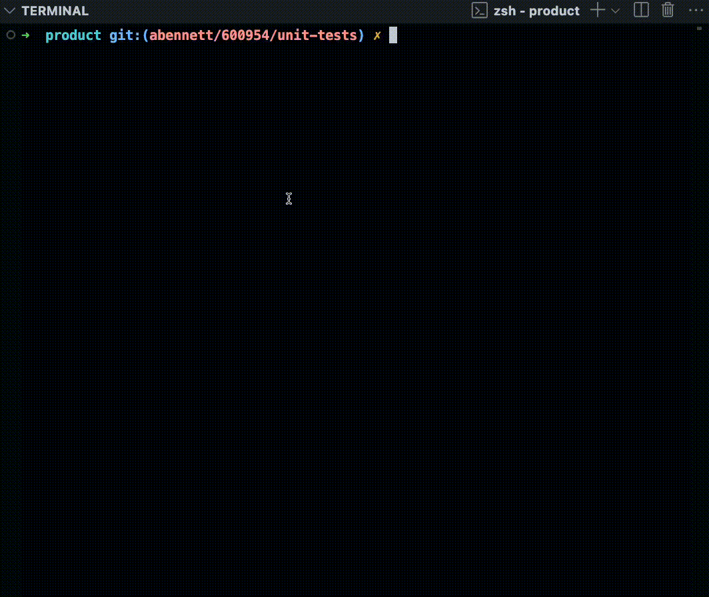

# Why I Love Working with RsPack

Our organization recently adopted RsPack for a large web development project.

So far the experience building with it has been remarkable. Everything our project needs is thoughtfully baked into RsPack and is exposed behind simple, familiar APIs.

Overall, it has brought me so much joy to work with the RsPack. Let's dive into some specific reasons why:

## Fully Typed

Every part of RsPacks API is described in simple, high-quality typescript types that makes navigating the RsPacks configuration options a breeze.

## Robust API

It’s no secret that Webpack's API - the bundler API Rspack implements - is big.

In fact, RsPacks API is so breath-takingly feature-rich that it could implement the functionality of any bundler on the market including Vite, Esbuild, and Webpack.

As a result, I don’t find myself having to write custom tooling on top of RsPack. There’s always some way to accomplish our Bundling or development server goals directly through the tool, without reaching for anything else.

## Ecosystem

RsPack is part of a large tooling ecosystem that includes things like RsBuild, a CLI for scaffolding apps. And, most recently, [RsLib](https://lib.rsbuild.dev/guide/start/index), a library bundler. 

### RsBuild 

RsBuild offers starter templates for react, lit, vue, solid and more. It also configures the js tooling with options like TS, Prettier, Biome, and Eslint.

Rspack ecosystem also includes tools like [RsDoctor](https://rsdoctor.dev/), a bundle analyzer: 

### RsDoctor

RsDoctor is the most advanced bundle analyzer on the market, offering file and plugin-level resolution, and a beautiful, interactive UI.

### RsLib

RsLib reprsents a big step forward in RsPack's ability to handle a wide variety of use cases such as advanced tree-shaking for libraries, something webpack has struggled with, leaving the community to adopt tools like Rollup.

## Developer Experience

Between the detailed documentation, fast refresh of all project files, thoughtful defaults, helpful errors, and information dense messages, the immediate developer experience comes with all the trappings I would expect from any great tool, in any part of the industry. 

For example: for those familiar with the Rust development experience in terms of compiler feedback, I find many similarities in the RsPack experience.

## Development Server

RsPack's development server provides more than just a fast, iterative development experience with HMR. 

It also supports our real-world business needs for use cases like integration with backend services, and provides a way to proxy requests to our backend services, as well as out of the box support for HTTPS and SSL certificates. 

On top of that, the development server does not require its own express-like server or middleware for proxying, as it is already baked into the tool. Which, by now, you're hopefully thinking "of course it is, duh".

## Worlds most advanced support for Module Federation.

Federation, which allows for both the sharing of code between applications at runtime *and* the runtime management of these shared modules, is a capability that is deeply engrained in RsPack's design. 

In fact, like webpack, it has the ModuleFederation Plugin already included. 

In addition, as the primary maintainers of Federation as a technology concept, the RsPack team is pushing forward the state of the art of Federation, using RsPack as the primary tool for this work.

## Sheer Speed

We’ve all heard the it's "bLaZiNg fAsT!” trope.

With RsPack, though, it’s not just hype. Our production builds takes 2-4 seconds. Tops.

B-b-but _my_ bundler is faster!

True, bundlers like EsBuild are extremely fast. This is because they implement only a small percent of RsPack's features, and generally don't support javascript plugins, which are much, much slower to manage.

RsPack, however, is fast while implementing a *superset* of Webpack's features. This says a lot about RsPack highly parallelized architecture.

## Conclusion

Tools should serve us, **not** the other way around.

RsPack is a tool that’s been designed to make our lives easier, and I can attest that it has served me and my team exceedingly well.

I simply cannot rave about this technology enough and I hope that this article has been able to convey some of that excitement. I also hope that one day you too will be able to experience the joy of working with RsPack, if not already!

## Acknowledgements

I would like to thank the entire RsPack team for their hard work and dedication to bringing the entre web forward with this amazing tool.

I also want to thank Zack Jackson for educating me on many of the finer points in this article realted to RsPack's functionality and design, as well as the lore and history of the project.